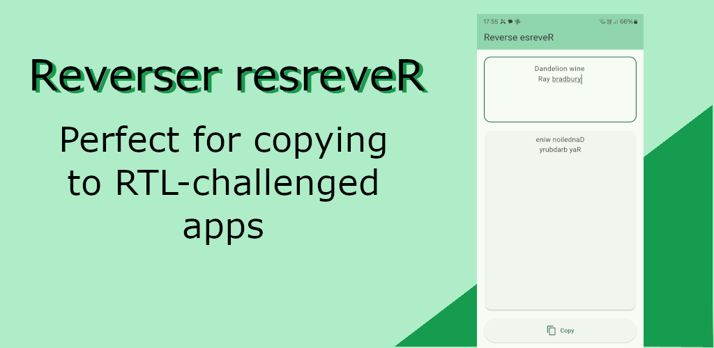

# Reverser

Reverses multiline text, line by line, with an option to copy results to clipboard.   
This is meant for use with RTL challenged apps that reverse RTL text. Reverser
helps you put the already reversed text in the app to get the results you want.

Try it out for [free](https://play.google.com/store/apps/details?id=com.honeystone.reverser) on Google Play.

## Getting Started

This is a "The name is on the tin" app. It does one thing, does it well, and doesn't try to distract you :)

 

https://github.com/user-attachments/assets/f857eb6a-db85-49f3-ad0f-4e54f9199d86

